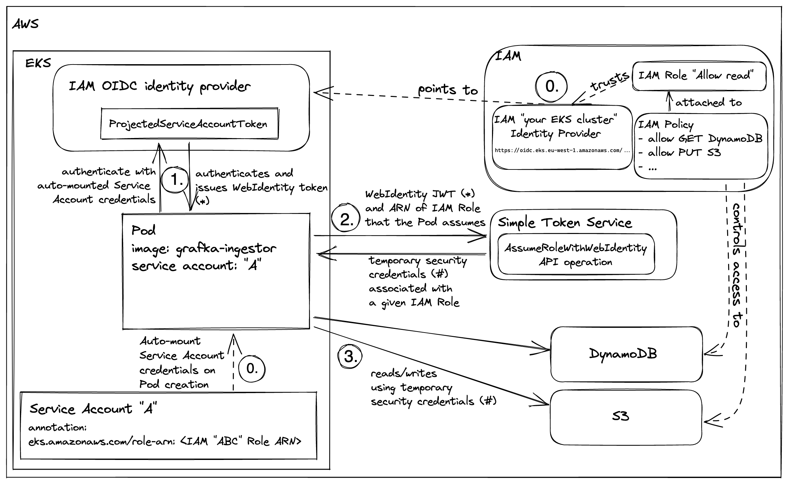
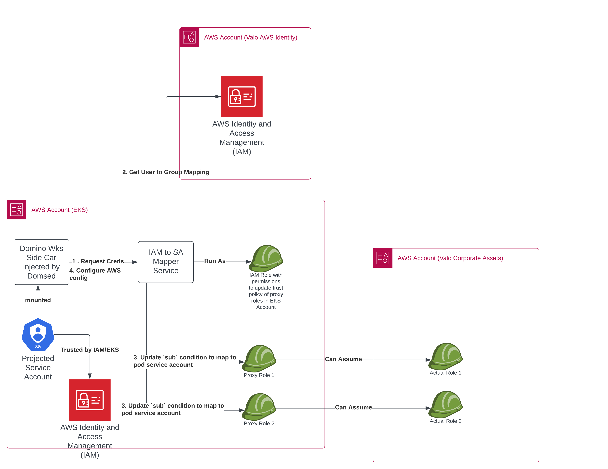

# User Documentation for IAM to K8s Service Account Mapping for Domino

This is a user document to allow Domino Administrators to map user workspaces to IAM roles. When the user starts a workspace,
the workspace will be configured to with a *aws config* file with a profile for each aws role the user is allowed to assume. the
name of the profile will the `aws role name` (not the whole ARN).

The user should be able to use the boto3 api simply by selecting a profile-

```python
import boto3
role_arn_profile_name = 'asset-update-bucket-role'
bucket_name = 'my_bucket'
session = boto3.session.Session(profile_name=role_arn_profile_name)
s3_client = session.client('s3')
for key in s3_client.list_objects(Bucket=bucket_name)['Contents']:
    print(key)
```

If the EKS cluster is in the same AWS account as the aws role being assumed the user can simply configure an environment 
variable `AWS_ROLE_ARN` (represented by one of the profiles) and start using the boto3 api-


```python
import os

eks_account_id = '11111111' #Provide your aws account id where the eks cluster is hosted
bucket_name = 'my_bucket'
os.environ['AWS_ROLE_ARN'] = f"arn:aws:iam::{eks_account_id}:role/customer-read-bucket-role"
import boto3.session
my_session = boto3.session.Session()
s3_client = my_session.client('s3')
for key in s3_client.list_objects(Bucket=bucket_name)['Contents']:
    print(key)
```

This approach cannot be used when the EKS Account Id and the account id where the AWS Roles are hosted are different. In 
that case the `AWS_CONFIG` file approach shown earlier is the only usable approach.

The following diagram shows how the full process works-


The EKS is already started while pointing to the OIDC Identity Provider

The webhook identity leverages the Service Account Token Volume Projection feature, 
which provides a pod with a newly created JWT that contains a specified audience and expiration. The cluster will
automatically rotate and update this token for as long as the pod is running.
To use this capability, you have to configure the Kube API server with the following flags:
```
--service-account-issuer - the issuer name for the cluster (this is typically a full URI for the issuer)
--service-account-signing-key-file - a private key to be used when signing the JWTs
--service-account-api-audiences - a list of audiences allowed to be specified in projected volumes. These also serve as defaults if no specific audience is indicated in mount config.
```
Note: It is important to remember that there are now two different types of SA tokens and each have a different 
structure! If you use or consume SA tokens, be sure you're using the expected type!

Once configured, pods can specify a projected volume and specify the expiration time (in seconds). 
Note that the `domsed` webhook does this part automatically for you by mutating your pod when it is being created. 
```yaml
apiVersion: v1
kind: Pod
metadata:
  name: test-iam-pod
spec:
  containers:
  - image: nginx
    name: nginx
    volumeMounts:
    - mountPath: /var/run/secrets/tokens
      name: aws-iam-token
  serviceAccountName: hello-world-app
  volumes:
  - name: aws-iam-token
    projected:
      sources:
      - serviceAccountToken:
          path: aws-iam-token
          expirationSeconds: 7200
          audience: aws-iam
```

For comparison the default K8s service account (which is not mounted in Domino pods) looks like this-
```json
{
  "iss": "kubernetes/serviceaccount",
  "kubernetes.io/serviceaccount/namespace": "default",
  "kubernetes.io/serviceaccount/secret.name": "default-token-x4sjk",
  "kubernetes.io/serviceaccount/service-account.name": "default",
  "kubernetes.io/serviceaccount/service-account.uid": "488d395f-34b0-4aab-871d-17087fc027f7",
  "sub": "system:serviceaccount:default:default"
}
```

Note the issuer is k8s cluster and it has no expiration data. It is used to access the kube-api server. 

The projected service account in comparison looks like this-
```json
{
  "aud": [
    "sts.amazonaws.com"
  ],
  "exp": 1674755267,
  "iat": 1674668867,
  "iss": "https://oidc.eks.eu-west-1.amazonaws.com/id/F4584A4B6D2265099906FC80AF564B16",
  "kubernetes.io": {
    "namespace": "domino-compute",
    "pod": {
      "name": "run-63d16b3ebe3729589c5bd9d8-mwlc2",
      "uid": "210cd280-1fe8-41ef-af96-53af291fccea"
    },
    "serviceaccount": {
      "name": "run-63d16b3ebe3729589c5bd9d8",
      "uid": "314ffbf4-d847-4680-bbf9-e521aabe86a7"
    }
  },
  "nbf": 1674668867,
  "sub": "system:serviceaccount:domino-compute:run-63d16b3ebe3729589c5bd9d8"
}
```

Note that this JWT has a issuer which is the OIDC Provider associated with the EKS cluster and trusted by IAM, it has a
`sub` field which identifies the service-account of the pod. It also has an expiry time associated with it.

The AWS clients (cli or boto3) will use this token encapsuated in the environment variable `AWS_WEB_IDENTITY_TOKEN_FILE`
to request a `assume-role` on a specific AWS role. This request will succeed if, the underlying AWS role has trust 
policy a condition which permits sts calls of there is a `aud` and `sub` field with matching values from the jwt above.



## Installation

In this document we will refer to two types of AWS Accounts

1. EKS AWS Account which hosts the EKS cluster.
2. Asset AWS Account which hosts the corporate AWS assets like RDS, S3. 

### Pre-requisites 

1. Inside the Domino cluster`domsed` to be pre-installed.
2. In the AWS account hosting the EKS cluster the following two steps need to be executed-
   
   a.  [Creating an IAM OIDC Provider for your cluster](https://docs.aws.amazon.com/eks/latest/userguide/enable-iam-roles-for-service-accounts.html)
   
   b.  For each role in the asset AWS Account, create a matching role in the EKS AWS Account and attach a policy to it which allows it to assume the corresponding role in the Asset AWS Account
   
   c. Add a trust relationship in the Asset AWS Account roles to trust the corresponding role in the EKS AWS Account
   
3. Create a role in EKS AWS Account which can list the roles in (b) and update the trust policy attached to the role. 
   This is necessary to add `Condition` elements in these policies which allow specific pod service accounts
   to assume roles.

### Install steps

1. Create and publish the docker image for the `iam-sa-mapping-svc.${platform_namespace}` service. 
   `./scripts/create_docker_image.sh` (Open the script and define the docker registry and version)
2. Create and publish the docker image for the container which will be injected as a side-car container 
   in the workspaces and jobs. This container calls the above service using the user JWT token mounted in it
   to create the `$AWS_CONFIG_FILE` with the profiles needed for the user to assume role.
   `./scripts/create_and_push_docker_side_car.sh`
3. Install the `iam-sa-mapping-svc.${platform_namespace}` service framework
   ```shell
   ./scripts/deploy.sh $VERSION $EKS_AWS_ACCOUNT $IAM_SA_ROLE $OIDC_PROVIDER_ARN $OIDC_AUDIENCE
   ```
   - Version - Is the docker image tag defined in (1)
   - EKS_AWS_ACCOUNT - AWS Account number where EKS is hosted
   - IAM_SA_ROLE - The role defined in (3). The `iam-sa-mapping-svc.${platform_namespace}` assumes this role
   - OIDC_PROVIDER_ARN - This is obtained from your EKS cluster description
   - OIDC_AUDIENCE - Use `sts.amazonaws.com`
4. Post Installation run the command below. This is needed if you map Domino organizations to roles.
   
```shell
  deploy-add.sh $ASSET_AWS_ACCOUNT $ASSET_EKS_ACCOINT $ROLE_PREFIX
```

There are three user roles in both of the account-

Roles in the Assets account are-

- `arn:aws:iam::${asset_aws_account}:role/${role_prefix}list-bucket-role`
- `arn:aws:iam::${asset_aws_account}:role/${role_prefix}read-bucket-role`
- `arn:aws:iam::${asset_aws_account}:role/${role_prefix}update-bucket-role`
   
Corresponding roles in the EKS Account are-

- `arn:aws:iam::${eks_aws_account}:role/${role_prefix}list-bucket-role`
- `arn:aws:iam::${eks_aws_account}:role/${role_prefix}read-bucket-role`
- `arn:aws:iam::${eks_aws_account}:role/${role_prefix}update-bucket-role`


Assume that the `role_prefix` is `test-cust` and we have a bucket in the Assets account called-
`test-cust-example-bucket`,

`arn:aws:iam::${asset_aws_account}:role/${role_prefix}list-bucket-role` has a trust relationship
```json
{
    "Version": "2012-10-17",
    "Statement": [
        {
            "Effect": "Allow",
            "Principal": {
                "AWS": "arn:aws:iam::${eks_aws_account}:root"
            },
            "Action": "sts:AssumeRole"
        }
    ]
}
```
is attached to a permission policy called
``arn:aws:iam::${asset_aws_account}:role/${role_prefix}list-bucket-policy` which is as follows:
```json
{
    "Version": "2012-10-17",
    "Statement": [
        {
            "Sid": "ListObjectsInBucket",
            "Effect": "Allow",
            "Action": [
                "s3:ListBucket"
            ],
            "Resource": [
                "arn:aws:s3:::test-cust-example-bucket"
            ]
        }
    ]
}
```

The corresponding role `arn:aws:iam::${eks_aws_account}:role/${role_prefix}list-bucket-role` has the
permission policy

```json
{
    "Version": "2012-10-17",
    "Statement": [
        {
            "Effect": "Allow",
            "Action": "sts:AssumeRole",
            "Resource": "arn:aws:iam::524112250363:role/customer-list-bucket-role"
        }
    ]
}
```

and a trust policy
```json
{
    "Version": "2012-10-17",
    "Statement": [
        {
            "Effect": "Allow",
            "Principal": {
                "Federated": "${OIDC_PROVIDER_ARN}"
            },
            "Action": "sts:AssumeRoleWithWebIdentity",
            "Condition": {
                "StringLike": {
                    "${OIDC_PROVIDER_ARN}:sub": [
                        "*63c091e065bbcf3b8f3d8df8",
                        "*63c0915465bbcf3b8f3d8de4"
                    ],
                    "${OIDC_PROVIDER_ARN}:aud": "sts.amazonaws.com"
                }
            }
        }
    ]
}
```

The section `StringLike` contains a list of pod service account prefixes which will be dynamically
generated using mutations which allow pod with the projected service account tokens to assume roles in
AWS Assets account using projected service accounts feature of K8s

The deep dive details of how this works is explained in the following blog articles-
- [IAM Roles of K8s Service Accounts Deep Dive](https://mjarosie.github.io/dev/2021/09/15/iam-roles-for-kubernetes-service-accounts-deep-dive.html)
- [EKS Pod Identity Webhook Deep Dive](https://blog.mikesir87.io/2020/09/eks-pod-identity-webhook-deep-dive/)


>The key feature of K8s which enables this capability is the concept of 
[service account token volume projection](https://kubernetes.io/docs/tasks/configure-pod-container/configure-service-account/#serviceaccount-token-volume-projection)
The Service Account Token Volume Projection feature of Kubernetes allows projection of time and audience-bound 
service account tokens into Pods. This feature is used by some applications to enhance security when using service accounts. 
*These tokens are separate from the default K8s service account tokens used to connect to the K8s API Server and 
disabled for user pods in Domino*. These tokens are issued by the IAM OIDC Provider configured in the AWS cluster and
are trusted by the AWS IAM which is how these tokens can be used to assume the appropriate IAM roles for the Pod.


>The installed service runs with the identity of the instance IAM role which has the following policy attached
> ```json

The Domino Service which performs the mapping also runs as a IAM Role which can have permissions to read these policies
and dynamically determine the user to role mappings. A sample role this Domino Service assumes is 
```json
{
    "Version": "2012-10-17",
    "Statement": [
        {
            "Sid": "VisualEditor1",
            "Effect": "Allow",
            "Action": "iam:*",
            "Resource": "arn:aws:iam::<EKS_ROLE>:role/test-cust*"
        }
    ]
}
```

This needs to be tightened a bit. The intent is provide this service with the ability to update the trust
policies of each user role in EKS AWS Account with the `Stringlike` condition to add/remove pod service accounts
```json
                "StringLike": {
                    "${OIDC_PROVIDER_ARN}:sub": [
                        "*63c091e065bbcf3b8f3d8df8",
                        "*63c0915465bbcf3b8f3d8de4"
                    ],
```


Coming back to 

```shell
  deploy-add.sh $ASSET_AWS_ACCOUNT $ASSET_EKS_ACCOINT $ROLE_PREFIX
```
This configures the following config maps in the platform namespace

```yaml
apiVersion: v1
kind: ConfigMap
metadata:
  name: domino-org-iamrole-mapping
data: {
    "iamrole-list-bucket":"arn:aws:iam::${asset_aws_account}:role/${role_prefix}list-bucket-role",
    "iamrole-read-bucket":"arn:aws:iam::${asset_aws_account}:role/${role_prefix}read-bucket-role",
    "iamrole-update-bucket":"arn:aws:iam::${asset_aws_account}:role/${role_prefix}update-bucket-role"
  }
```

```yaml
apiVersion: v1
kind: ConfigMap
metadata:
  name: resource-role-to-eks-role-mapping
data: {
  "${role_prefix}list-bucket-role":"arn:aws:iam::${eks_aws_account}:role/${role_prefix}list-bucket-role",
  "${role_prefix}read-bucket-role":"arn:aws:iam::${eks_aws_account}:role/${role_prefix}read-bucket-role",
  "${role_prefix}update-bucket-role":"arn:aws:iam::${eks_aws_account}:role/${role_prefix}update-bucket-role"
}
```

This step is for the reference implementation where the mapping between IAM Roles and users are based on
a one-to-one mapping between a Domino Org and a AWS IAM Role. User is permitted to assume roles based on
the membership to an Org. To customize this behaviour update the endpoint in the file 
`iam_to_sa_mapping/iam_to_sa_service.py`

```python
@app.route("/get_my_roles", methods=["GET"])
def get_my_roles() -> tuple:
    headers = get_domino_api_headers(request.headers)
    platform_ns = os.environ.get('DEFAULT_PLATFORM_NS', DEFAULT_PLATFORM_NS)
    return {'result':aws_utils.get_domino_users_iamroles(platform_ns,headers)}
```


5. Lastly deploy the mutation
```shell
./scripts/deploy_mutation.sh
```

This mutation will apply the following changes to the workspace and job pods 

a. Deploys volume mounts for the projected pod service accounts, 

b. For the `run` container 
configures the AWS Environment Variables
- `AWS_WEB_IDENTITY_TOKEN_FILE`
- `AWS_CONFIG_FILE`

c. Creates a side-car container which on startup configures the `AWS_CONFIG_FILE` with the appropriate profiles 

The mutation definition is 

```yaml
apiVersion: apps.dominodatalab.com/v1alpha1
kind: Mutation
metadata:
  name: aws-iam-to-sa-mapping
rules:
- labelSelectors:
  - "dominodatalab.com/workload-type in (Workspace,Job)"
  modifySecurityContext:
    context:
      fsGroup: 12574
- labelSelectors:
  - "dominodatalab.com/workload-type in (Workspace,Job)"
  insertContainer:
    containerType: app
    spec:
      image: ${image}:${VERSION}
      name: aws-config-file-generator
- labelSelectors:
  - "dominodatalab.com/workload-type in (Workspace,Job)"
  insertVolumeMounts:
    containerSelector:
    - aws-config-file-generator
    volumeMounts:
    - name: jwt-secret-vol
      mountPath: /var/lib/domino/home/.api
      readOnly: true
    - name: podinfo
      mountPath: /var/run/podinfo
      readOnly: true
- labelSelectors:
  - "dominodatalab.com/workload-type in (Workspace,Job)"
  insertVolumes:
  - name: aws-config-file
    emptyDir:
      sizeLimit: 500Mi
  - name: podinfo
    downwardAPI:
      items:
        - path: "labels"
          fieldRef:
            fieldPath: metadata.labels
  - name: aws-user-token
    projected:
      defaultMode: 422
      sources:
      - serviceAccountToken:
          path: token
          expirationSeconds: 86400
          audience: sts.amazonaws.com
- labelSelectors:
  - "dominodatalab.com/workload-type in (Workspace,Job)"
  insertVolumeMounts:
    containerSelector:
    - run
    volumeMounts:
    - name: aws-config-file
      mountPath: /var/run/.aws
    - name: aws-user-token
      mountPath: /var/run/secrets/eks.amazonaws.com/serviceaccount/
      readOnly: true
- labelSelectors:
  - "dominodatalab.com/workload-type in (Workspace,Job)"
  insertVolumeMounts:
    containerSelector:
    - aws-config-file-generator
    volumeMounts:
    - name: aws-config-file
      mountPath: /var/run/.aws
    - name: aws-user-token
      mountPath: /var/run/secrets/eks.amazonaws.com/serviceaccount/
      readOnly: true
- labelSelectors:
  - "dominodatalab.com/workload-type in (Workspace,Job)"
  modifyEnv:
    containerSelector:
    - aws-config-file-generator
    env:
    - name: POD_INFO_PATH
      value: /var/run/podinfo/labels
    - name: DOMINO_TOKEN_FILE
      value: /var/lib/domino/home/.api/token
- labelSelectors:
  - "dominodatalab.com/workload-type in (Workspace,Job)"
  modifyEnv:
    containerSelector:
    - run
    - aws-config-file-generator
    env:
    - name: AWS_WEB_IDENTITY_TOKEN_FILE
      value: /var/run/secrets/eks.amazonaws.com/serviceaccount/token
    - name: AWS_CONFIG_FILE
      value: /var/run/.aws/config
    - name: IAM_SA_MAPPING_ENDPOINT
      value: http://iam-sa-mapping-svc.domino-platform/map_iam_role_to_pod_sa
```

The `AWS_CONFIG_FILE` can be refreshed by the user by executing the following lines of python code

```python
import requests

import os

url = 'http://iam-sa-mapping-svc.domino-platform/map_iam_role_to_pod_sa'
headers = {"Content-Type" : "application/json",
           "X-Domino-Api-Key": os.environ['DOMINO_USER_API_KEY'] 
          }
data = {    
    "run_id" : os.environ['DOMINO_RUN_ID']
}

resp = requests.post(url,headers=headers,json=data)
# Writing to file
with open(os.environ['AWS_CONFIG_FILE'], "w") as f:
    # Writing data to a file
    f.write(resp.content.decode())
    
```
Everytime a workspace starts up the user can check the available aws profiles by running the following 
python snippet-

```python
import boto3
import boto3.session
for profile in boto3.session.Session().available_profiles:
    print(profile)
```

It will echo something which looks like the following output
```shell
test-cust-list-bucket-role
src_test-cust-list-bucket-role
test-cust-read-bucket-role
src_test-cust-read-bucket-role
test-cust-update-bucket-role
src_test-cust-update-bucket-role
```

Net the user can determine the caller identity after picking a profile

```python
import boto3
session = boto3.session.Session(profile_name='test-cust-update-bucket-role')
sts_client = session.client('sts')
sts_client.get_caller_identity()
```
which will print out the details of the web identity assumed

```json
{'UserId': 'AROAXUB4GIX5ZUPNF3QJ3:botocore-session-1673564560',
 'Account': '${asset_aws_account}',
 'Arn': 'arn:aws:sts::${asset_aws_account}:assumed-role/test-cust-update-bucket-role/botocore-session-1673564560',
 'ResponseMetadata': {'RequestId': '4822c15b-25b9-487d-aac1-406240af22b9',
  'HTTPStatusCode': 200,
  'HTTPHeaders': {'x-amzn-requestid': '4822c15b-25b9-487d-aac1-406240af22b9',
   'content-type': 'text/xml',
   'content-length': '484',
   'date': 'Thu, 12 Jan 2023 23:02:41 GMT'},
  'RetryAttempts': 0}}
```

Finally the user can list the bucket as follows:

```python
import boto3
session = boto3.session.Session(profile_name='test-cust-update-bucket-role')

s3_client = session.client('s3')
for key in s3_client.list_objects(Bucket='customer-test-bucket')['Contents']:
    print(key)
```

which will print the listing of the bucket.
